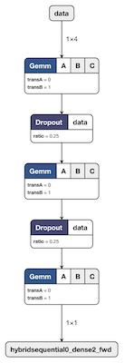

### MXNet to ONNX to ML.NET

This is an example project to show how an Apache MXNet MLP model can be exported to the ONNX format and subsequently be used in ML.NET. The challenge was running inference in ML.NET because at the time of writing, the ONNX Transformer was only supported on Windows [ref](https://blogs.msdn.microsoft.com/dotnet/2018/10/08/announcing-ml-net-0-6-machine-learning-net/).

# **Tutorial**

**An in-depth tutorial describing the process and how to productionize the whole ML pipeline in AWS is described on my blog:**

[MXNet to ONNX to ML.NET with SageMaker, ECS and ECR](https://cosminsanda.com/posts/mxnet-to-onnx-to-ml.net-with-sagemaker-ecs-and-ecr/)

**To follow the tutorial, all you need in terms of software requirements are a browser and an RDP client.**

### Requirements

For the _Modeling_ part you need Docker to use Linux containers.

For the _Inference_ part you need Docker to use Windows containers. You need to be on Windows to be able to do this.

If you do not have a Windows box, you can just run the modeling part.

#### Modeling

The data for this example comes from the [New York taxi fare dataset](https://www.kaggle.com/c/new-york-city-taxi-fare-prediction/data).

The model that will be created will solve a regression problem. Note that I have not focused on creating a low error model, but focused more on the process.

The model artefacts are already in the repository and running the modelling step is not strictly required.

##### Usage

* Windows
    * Use PowerShell
    * Make sure you use Linux containers [How to guide](https://docs.docker.com/docker-for-windows/#switch-between-windows-and-linux-containers)
    * Build image `docker build -t mxnet-onnx-mlnet-modeling -f Dockerfile.modeling .`
    * Run container: `docker run -p 8888:8888 -v ${pwd}/data:/notebook/data/:ro -v ${pwd}/models:/notebook/models mxnet-onnx-mlnet-modeling`
* \*nix
    * Build image `docker build -t mxnet-onnx-mlnet-modeling -f Dockerfile.modeling .`
    * Run container: `docker run -p 8888:8888 -v $(pwd)/data:/notebook/data/:ro -v $(pwd)/models:/notebook/models mxnet-onnx-mlnet-modeling`

### Inference

Use the generated _ONNX_ model for running an inference web service.

##### Usage

 * Make sure Docker uses Windows containers [How to guide](https://docs.docker.com/docker-for-windows/#switch-between-windows-and-linux-containers)
 * Build image `docker build -t mxnet-onnx-mlnet-inference -f Dockerfile.inference .`
 * Run container based on the built image `docker run -p 5000:80 mxnet-onnx-mlnet-inference`
 * Test with a cURL call or similar. Eg: `curl -H "Content-Type: application/json" -d "{'RateCode':1.0,'PassengerCount':1.0,'TripTime':1.0,'TripDistance':1.0}" http://localhost:5000`
